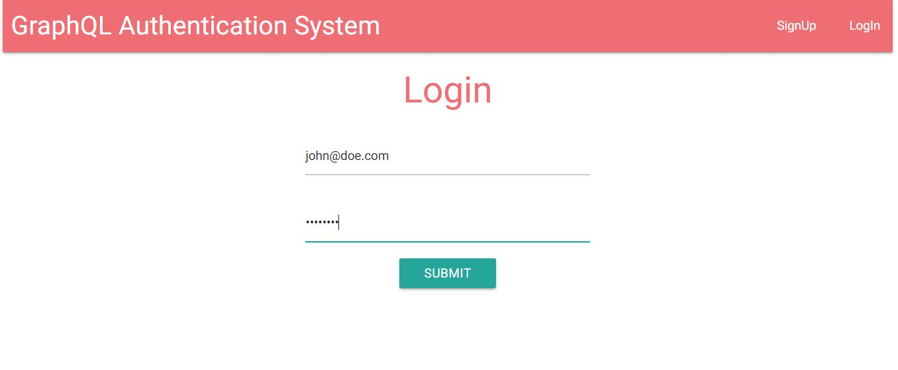
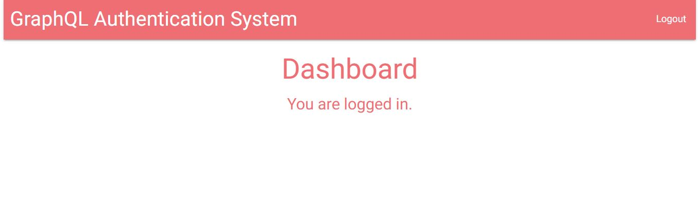

## GraphQL Authentication Starter App

This application consists in a basic user authentication system using PassportJS and GraphQL technologies, it was created following this [Project Setup](https://github.com/stephengrider/auth-graphql-starter).
Users can sign up in the application and PassportJS handles the authentication, storing a session cookie in the database which remains until the user logs out of the session.

## Built With

- Express (Http Server)
- MongoDB (Online DB)
- Passport (Authentication)
- GraphQL (Query Language)
- Apollo (State Management)
- ReactJS (Frontend)
- Materialize CSS (Styling)

## App Screenshots




## Setup instructions

Open a terminal window, go to the location you'd like to add the project and then run the commands below.

```console
git clone https://github.com/noomdalv/graphql_auth_starter.git
```

```console
cd graphql_auth_starter
```

```console
npm install
```

```console
npm run dev
```

## Author

👤 **Vladimir Luna**

- Github: [@noomdalv](https://github.com/noomdalv)


## 📝 License

This project is [MIT](lic.url) licensed.
